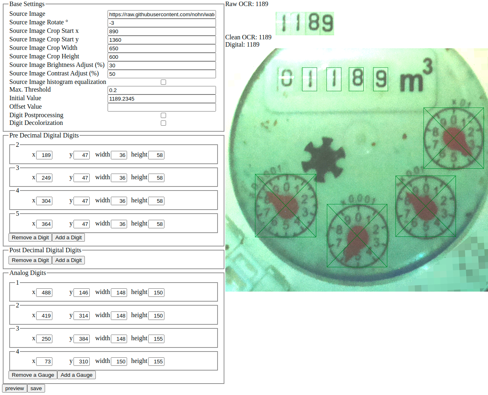

# Home Assistant watermeter addon
This is a fork of nohn/watermeter for allowing easy integration into Home Assistant
Reads analog water meters and provides a web service that returns the read value as decimal. The needles of the analog gauges currently have to be red.

### Configuration

You can access the configuration tool http://watermeter:3000/configure.php. The interface should be self explanatory. Source Image can be either in local filesystem or any HTTP(S) resource.

After configuration is done, you can access the current value at

    http://watermeter:3000/

or

    http://watermeter:3000/?json

or see debug information at

    http://watermeter:3000/?debug

## How to contribute

You can contribute to this project by:

* Opening an [Issue](https://github.com/nohn/watermeter/issues) if you found a bug or wish to propose a new feature
* Placing a [Pull Request](https://github.com/nohn/watermeter/pulls) with bugfixes, new features etc.

## You like this?

Consider a [gift](https://www.amazon.de/hz/wishlist/ls/3HYH6NR8ZI0WI?ref_=wl_share).

## License

analogmeterreader is released under the [GNU Affero General Public License](LICENSE).
